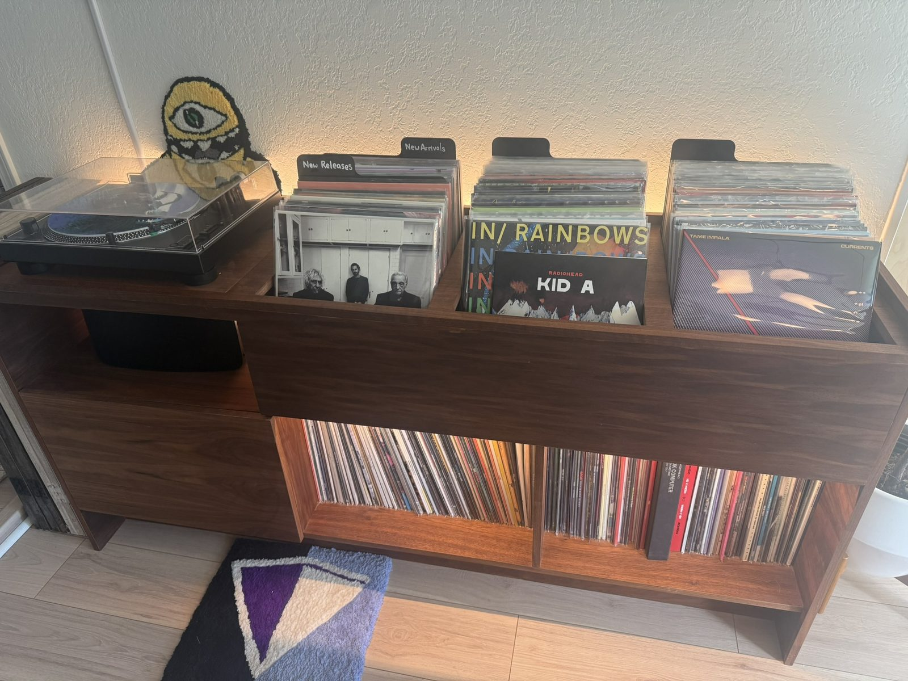
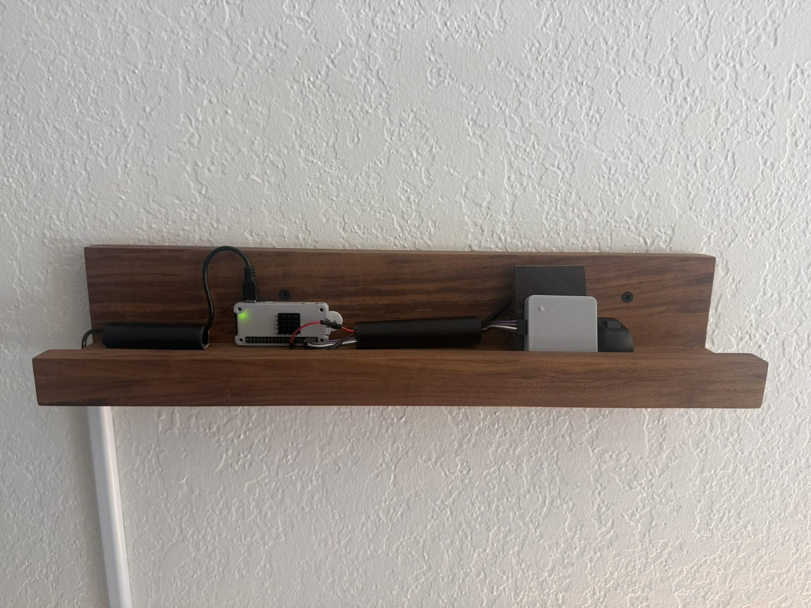
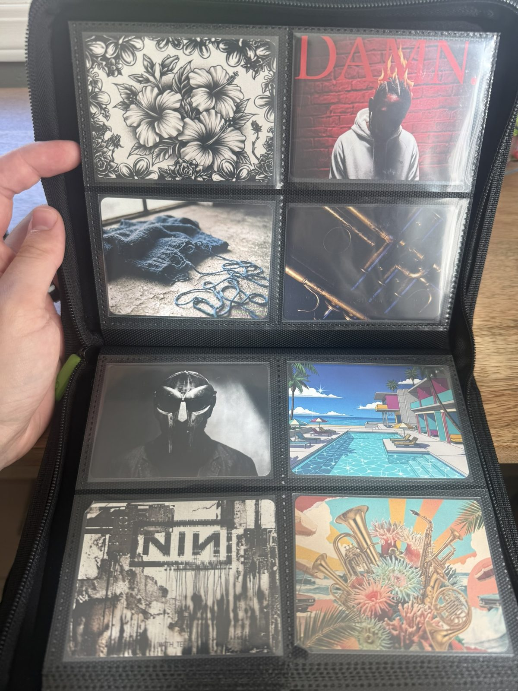
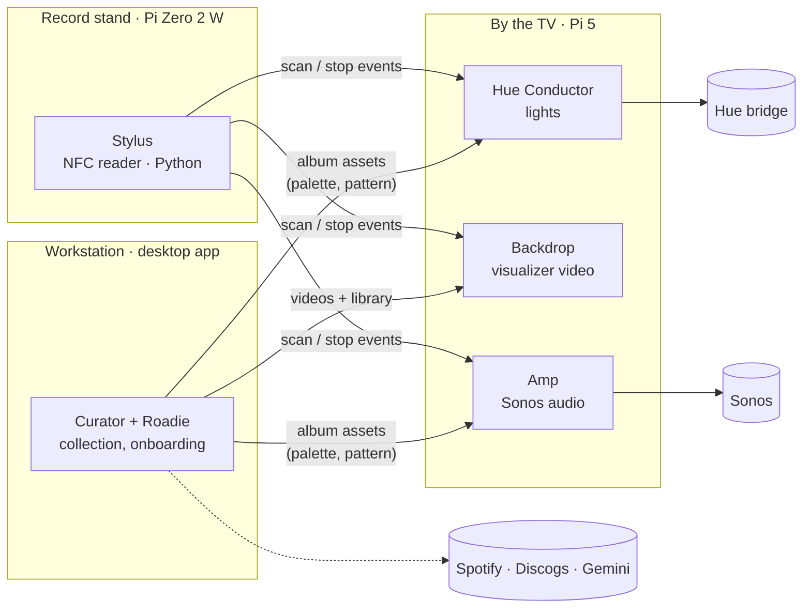

# Marquee

_An immersive jukebox. Place a tagged record sleeve on the stand — the lights and the display
become the record. Lift it — the room returns to normal._



https://github.com/user-attachments/assets/87092e3c-9a72-40c8-ad9d-9b20dd1c8609

An NFC reader hidden in a record stand identifies the sleeve. The room's Philips Hue lights take on
a palette pressed from the album's cover art, a TV plays a looping visualizer made for that record,
and — for a tagged card rather than a sleeve — the album starts on the house Sonos. Lifting the
record puts the room back exactly how it was.

It is a small distributed system: five services across a Windows workstation, a Raspberry Pi 5 and
a Raspberry Pi Zero 2 W, in TypeScript and Python, talking over versioned JSON contracts on the LAN.

## In the room

<table>
  <tr>
    <td width="50%"></td>
    <td width="50%"></td>
  </tr>
  <tr>
    <td>The stand, opened up: the Pi Zero 2 W that runs Stylus, wired to the NFC reader.</td>
    <td>Album cards with art I designed. Each carries a tag, so scanning a card plays the album
    over Sonos.</td>
  </tr>
</table>

**Curator**, the desktop app where the collection is built — browsing the shelf, tuning a record's
palette, and previewing it in the room:

https://github.com/user-attachments/assets/8e5b07be-0339-4dca-be6d-f34ab663000e

## How it works



| Piece             | What it does                                                                                  | Runs on               | Package                  |
| ----------------- | --------------------------------------------------------------------------------------------- | --------------------- | ------------------------ |
| **Stylus**        | Reads NFC tags, debounces them, and fans scan events out to the runtime services              | Pi Zero 2 W, in stand | `packages/stylus`        |
| **Hue Conductor** | Drives the Hue lights from a palette + pattern; restores the room afterwards                  | Pi 5                  | `packages/hue-conductor` |
| **Backdrop**      | Plays the record's looping visualizer in a kiosk browser                                      | Pi 5, on the TV       | `packages/backdrop`      |
| **Amp**           | Streams a card-tagged album (or one chosen track) over Sonos via local UPnP                   | Pi 5                  | `packages/amp`           |
| **Curator**       | The admin app and source of truth for the collection; hosts **Roadie**, the onboarding agent  | Workstation           | `packages/curator`       |
| **Palette Press** | Pure library: album art → a Hue-safe palette and a light pattern                              | (library)             | `packages/palette-press` |
| **Desktop**       | Electron shell that supervises Curator + a local Conductor in one window                      | Workstation           | `packages/desktop`       |
| **Deploy**        | Puts one pinned commit on every host and verifies it landed                                   | Workstation → Pis     | `packages/deploy`        |
| **Contracts**     | JSON Schemas + types for every service boundary, shared by TypeScript and Python              | —                     | `packages/contracts`     |
| **Fakes**         | Hand-written fakes of every external dependency (Hue bridge, Spotify, Discogs, Gemini, PN532) | —                     | `packages/fakes/*`       |

The one-page systems doc is [docs/specs/runtime-overview.md](docs/specs/runtime-overview.md) —
start there, then the per-service specs in [docs/specs/](docs/specs/).

## Engineering highlights

- **Hang-safe hardware I/O.** A wedged I²C call blocks inside a C extension where Python can't
  interrupt it, and systemd can't see a hang. [`bounded.py`](packages/stylus/stylus/bounded.py)
  turns the hang into a crash so `Restart=always` can recover it — the reasoning is in the module
  docstring. See also [`watchdog.py`](packages/stylus/stylus/watchdog.py).
- **Property-tested state machines.** Stylus's scan/swap/lift logic is pure and tested with
  Hypothesis ([`state_machine.py`](packages/stylus/stylus/state_machine.py),
  [tests](packages/stylus/tests/test_state_machine.py)).
- **Contracts across the language boundary.** Every inter-service payload has a JSON Schema in
  [`packages/contracts/schemas`](packages/contracts/schemas), validated by the TypeScript services,
  the Python reader, and a cross-service [contract test suite](contract-tests/).
- **Runs without the hardware.** Each external system has a hand-written fake — a Hue CLIP v2
  bridge, Spotify, Discogs, Gemini, the PN532 reader — so the whole stack is testable on a laptop.
- **Colour science for real lights.** [Palette Press](packages/palette-press) extracts swatches,
  clamps them into the Hue gamut in CIE xy, filters by ΔE contrast, detects monochrome art, and
  picks a light pattern from the palette's energy.
- **Deterministic deploys.** `pnpm run deploy` puts one pinned commit on every host, converges the
  systemd units by hash, rolls back on a failed restart, and proves the result
  ([ADR 0080](docs/adrs/0080-deployment-is-one-pinned-commit-verified-on-every-host.md)).
- **Measured, not guessed.** An always-on system has an idle budget:
  [idle-cost-baseline.md](docs/specs/idle-cost-baseline.md) measures every configuration (none costs
  more than 1.2% of one CPU core). CI is cost-engineered the same way
  ([ADR 0064](docs/adrs/0064-ci-is-priced-per-pr-expensive-checks-move-to-nightly.md)).
- **Decisions on the record.** 95 [architecture decision records](docs/adrs/) and specs that are
  kept in step with the code — when the code deviates, the spec is updated and an ADR says why.

## Why I built it

Marquee started as a way to combine several things I care about — records, immersive art, and
building things. It became a way to work with technology that was new to me — embedded hardware, a
Python service on a Raspberry Pi, colour science for real lights, prompting strategies for generated
video and card art — and an experiment in building my own coding harness around AI agents.

## How it was built

I designed it first. I wrote down the requirements, then built small [spikes](spikes/) to prove the
risky pieces worked together before committing to an architecture. I had Claude Code turn that into
a full architecture spec, then reviewed and critiqued it over several rounds — changing parts for
cost, and cutting or keeping parts depending on what I wanted to build myself — before signing off,
committing the spec, and having Claude Code build it in phases.

The calls that were mine: the architecture and service boundaries, the testing strategy, the
high-level decisions, the design of the harness and the review of what it produced, and the media
itself — the card art and the visualizer videos. The [specs](docs/specs/) stayed the source of
truth throughout: whenever something changed, the spec was amended in the same change and the
decision recorded as an [ADR](docs/adrs/), so the documents never drifted from the code. Bug fixes
are test-first: each starts with a failing test that reproduces the bug, then closes the gap in the
harness that let it through ([bug-fix-workflow.md](docs/specs/bug-fix-workflow.md)).

The build used [Claude Code](https://claude.com/claude-code) across Claude Opus 4.7, 4.8 and 5.5 —
which is why many commits carry a co-author trailer — and Claude Design for a later overhaul of the
Curator UI, whose design was then brought back into the codebase and rebuilt. Gemini drafts the
per-record visualizer prompts. The harness is a set of [agent reviewers](review-agents/README.md),
plus a practice of filing GitHub issues as hand-offs between Claude Code sessions so I could run
several agents in parallel. I ran it on a Claude Max subscription and GitHub's free plan, so most
agent work runs locally rather than in CI, and
[CI itself is priced per PR](docs/adrs/0064-ci-is-priced-per-pr-expensive-checks-move-to-nightly.md).
As the only developer, that was a trade I was happy to make.

## What I got wrong

The harness grew heavier than the problems it solved. When I measured it, a single review ran 8
reviewers three times each — 24 sessions and about ten minutes — and the ledger meant to track
their value had four entries and had changed no decisions. Models had also improved enough to catch
most of what several of the reviewers were built for. So I retired those reviewers and the process
around them, and cut the harness to
[three reviewers and one command](docs/adrs/0092-the-harness-is-three-reviewers-and-one-command.md).

## What's next

A wishlist: flagging records I want but don't own yet, and exploring my own taste to find new music
— rather than relying on streaming services' recommendation algorithms.

## Tech stack

TypeScript on Node 22 (Fastify, React + Vite, Electron, Vitest) · Python 3.11 (stdlib core,
Hypothesis) · pnpm workspaces + Turborepo · JSON Schema · GitHub Actions · Raspberry Pi 5 and Pi
Zero 2 W, PN532 NFC over I²C, systemd · Philips Hue CLIP v2, Sonos UPnP, Spotify, Discogs and
Gemini APIs.

## Getting started

Needs Node 22 and pnpm 9 (Python 3.11+ only for Stylus).

```bash
pnpm install         # also installs the git hooks (husky)
pnpm run setup       # verifies the toolchain, seeds .env from .env.example
pnpm run build
pnpm run test:fast   # unit + contract tests — no hardware or API keys needed
```

Building the real thing — accounts, the Hue pairing, the Pis and the stand — is covered in
[docs/SETUP.md](docs/SETUP.md), with a phased bill of materials in
[docs/specs/parts-list.md](docs/specs/parts-list.md) and deployment in
[packages/deploy](packages/deploy).

## Repo layout

```
packages/        the services, libraries, desktop shell, deploy tool, and fakes
contract-tests/  cross-service boundary tests against the shared schemas
fixtures/        synthetic cover art, golden palettes, test data
review-agents/   the three custom code reviewers (`pnpm run review`)
spikes/          throwaway feasibility experiments, each tied to an ADR
flipper/         a Flipper Zero app for writing tags
docs/specs/      the specs — the source of truth for behaviour
docs/adrs/       architecture decision records
```

## License

[MIT](LICENSE). Marquee is a personal project and is not affiliated with or endorsed by Signify
(Philips Hue), Sonos, Spotify, Discogs or Google; their names are used only to describe what
Marquee works with.
